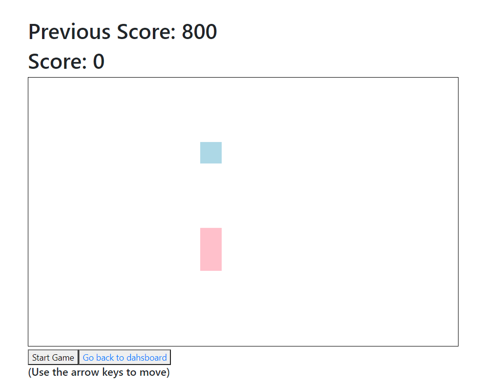

**Scope of the project**: This project aims to implement a simple back-end using Firebase to provide data storage of user accounts and their score while the front-end logic keeps track of the player score, re-routing from dash-board to game-board and vice-versa. Also a refactor that was pending in the original snake project was made. (Thanks to youtuber Weibenfalk for his tutorial on the snake game:  youtube.com/channel/UCnnnWy4UTYN258FfVGeXBbg)

**Steps to install**:

1. To install the packages use ### `npm start`, then ### `npm run`.

2. You will need a Firebase account in order to use the back-end:

   -Copy the Firebase SDK snippet for your account.
   -Create an .env.local file in your root folder.
   -Make sure you use REACT_APP_. Example: REACT_APP_FIREBASE_API_KEY=xxxxxxxxxx

